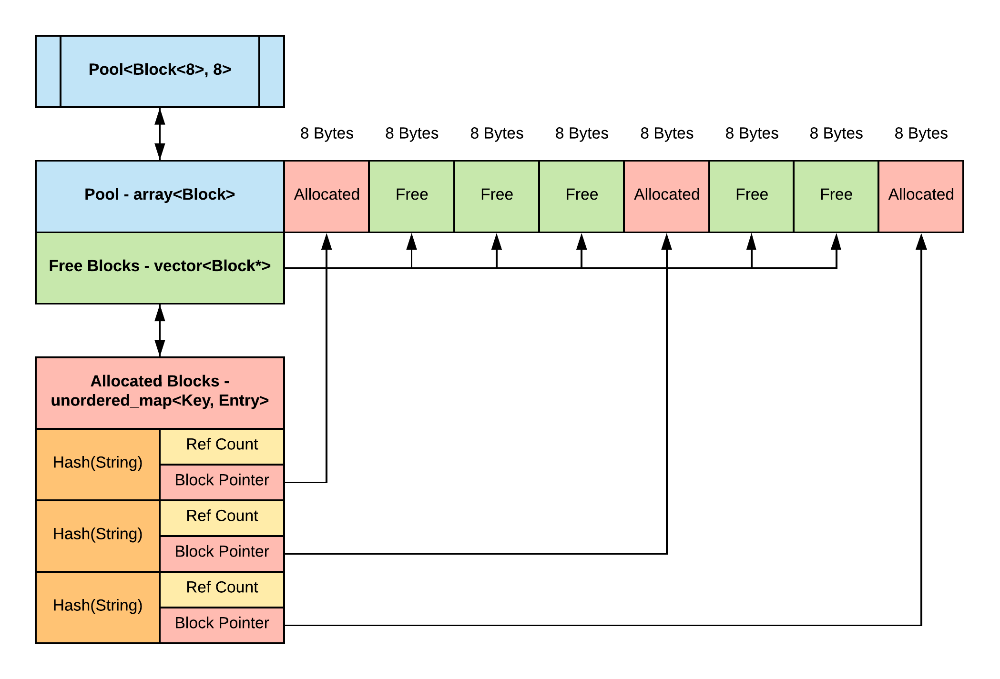

# Repo Notes
* Practice project to learn more about string pools and string allocation strategies.


# String Pool
* A string pool is a specialized memory pool that attempts to efficiently manage and mitigate some of the more expensive operations required when utilizing strings in an application. This could include, but is not limited to, decreasing the cost of dynamic allocation, memory usage, and comparison operations.

#### What's wrong with std::string or similar?
* `std::string` is a great data structure that performs well across a variety of applications. In the general case most developers do not necessarily need to be concerned about the internal allocation strategy used by the standard library. However, when the dynamic allocations performed by `std::string` start to impact performance in real-time applications or start to consume too much of the heap a string pool is one option to try. 

## Benefits
* Eliminate or greatly reduce heap allocations depending on your chosen implementation. Moving string allocations to the stack can greatly improve an application's efficiency if used with strings of a reasonable length due to the ability to take advantage of data locality and the other benefits absent in the heap that are present when using the stack.

* Reduce redundant string allocations. If a string is already allocated and present in the pool simply return a pointer to that string and increment the reference count. Similarly when an object owning a pointer to this resource leaves scope decrement the count. 

* Faster equality comparisons (pointer vs pointer `O(1)`) rather than an `O(n)` value comparison. It is important to note that this could still be required is some cases if the application needs to operate with types outside of the scope of this data structure and its related objects

## Costs
* A string pool adopts all the non-trivial problems present in heap allocation. This means we need to develop our own strategy for memory allocation and dealing with internal and external fragmentation. Every solution to this problem comes with tradeoffs.

* Parallel performance will take a hit since String Pools are usually centralized shared resources that will require some sort of concurrency control if  mutations are performed from multiple threads concurrently. Granted this argument could be made with a lot of centralized structures

# Implementation / Design


## Allocation Strategy



* In this implementation pools are a fixed size of N Blocks. The size of each block is uniform. One block corresponds to one unique string with a length that is equal to or smaller than the block size. This implementation borrows concepts from the segregated fit and free list algorithms.
* In other more involved implementation the pool could define behaviors for how blocks could expand/collapse into continuos groups to allow strings of a varying length that exceed may one block. However I opted away from this design due to the additional overhead of tracking adjacent blocks of varying sizes and the increased possibility of external fragmentation. I think
* Instead this implementation lends itself to defining a custom wrapper object that could manages several pools of the various block sizes required by your application. For example it wouldn't make sense to define your pool of 100 blocks to be 16 bytes each if you only expect your application to handle strings that are 4-7 characters long.
* The main data structure in the implementation is an array of blocks. This array contains the allocated strings. In order to allocate or retrieve strings this implementation relies on two auxiliary data structures. A vector of Block pointers tracks unallocated blocks, and a hashmap tracks allocated blocks and occurrences.

### Complexity Analysis
- Create New String - Average `O(1)`
- Retrieve Old String - Average `O(1)`

<i>Note:
  Allocation will fail if the string exceeds the specified block size or there are no free blocks available
</i>

### Error Handling
* If a string cannot be allocated due to its size it will return a string with an internal `const char*` member that is set to `nullptr`.
* If the pool does not contain any free blocks a `PoolOutOfMemory` error is thrown

### Demo / Tests
To Build
```
mkdir -p build 
cd build && cmake .. && make
./StringPoolExample

// Expected Output
[Passed] Expect | Pool size to be equal to the number of blocks multiplied by the pool block size
[Passed] Expect | First instance of PoolString to have 1 occurrence
[Passed] Expect | Second instance of PoolString to have 2 occurrence
[Passed] Expect | Pool to free block when all allocated strings associated with block leave scope
[Passed] Expect | Pool to correctly track available blocks before an allocation
[Passed] Expect | Pool to correctly track reserved blocks before an allocation
[Passed] Expect | Pool to correctly track available blocks after an allocation
[Passed] Expect | Pool to correctly track available blocks after an allocation
[Passed] Expect | Pool to correctly reset
[Passed] Expect | Pool to fail to allocate a PoolString that exceeds the block size
[Passed] Expect | Pool to fail to allocate a new PoolString when the pool is full

Press Any Key To Exit..
```

Example Usage
```
// Define Dimensions of Pool
constexpr size_t BLOCK_SIZE = 8;
constexpr size_t BLOCK_COUNT = 32;

// Initialize Pool
Pool<Block<BLOCK_SIZE>, BLOCK_COUNT> pool;

// Create a new string
PoolString string1 = pool.findOrCreate("New String");
std::cout << string1 << std::endl;

// If the same string is created again they will share the same block
PoolString theSameString = pool.findOrCreate("New String");
std::cout << theSameString << std::endl;
```
* See StringPoolTest.cpp for more in depth examples
